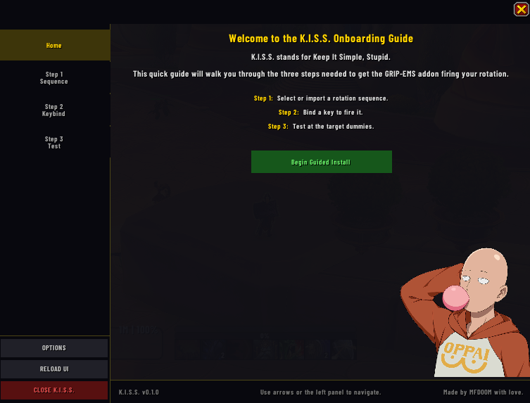
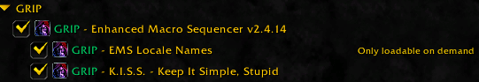

# K.I.S.S. (Keep It Simple, Stupid)

  

GRIP-EMS-KISS is a plugin for [GRIP-EMS](https://www.curseforge.com/wow/addons/grip-enhanced-macro-sequencer) (GRIP - Enhanced Macro Sequencer),that walks you through the three things you need to do to get it working: pick or import a sequence, bind a key to it, then test it out. The acronym stands for Keep It Simple, Stupid. A newcomer to the addon may feel overwhelmed by all the settings and options. This addon aims to make it as simple as possible to get you rockin' and rollin'

## Features

- A guided step by step wizard anyone can follow.
- Lets you pick from sequences you already have, or loads GRIP-EMS's import window if you need to load one. Includes links to external sites for finding rotations.
- Lets you set a keybind with one click, applied through GRIP-EMS automatically.
- A final page with tips if something isn't working, plus a link to the [GRIP-EMS Discord](https://discord.gg/XQXH3nt2X8) 
- Opens by itself the first time you install it. After that, type `/gems kiss` anytime to bring it back.

## Requirements

- World of Warcraft: Retail 12.1+
- [GRIP-EMS](https://www.curseforge.com/wow/addons/grip-enhanced-macro-sequencer) installed and enabled. K.I.S.S. is just a companion plugin and won't load without it

## How to install it

1. Download or clone this repository
2. Copy the `GRIP-EMS-KISS` folder into your `World of Warcraft/_retail_/Interface/AddOns/` folder
3. Start WoW and enable **GRIP - K.I.S.S. - Keep It Simple, Stupid** in your AddOns list
   

## Options and commands

- The first time you log in, the wizard opens on its own
- You can reopen it anytime by typing `/gems kiss`

## Credits

Made by MFDOOM with love.

## License

See [LICENSE](LICENSE).
